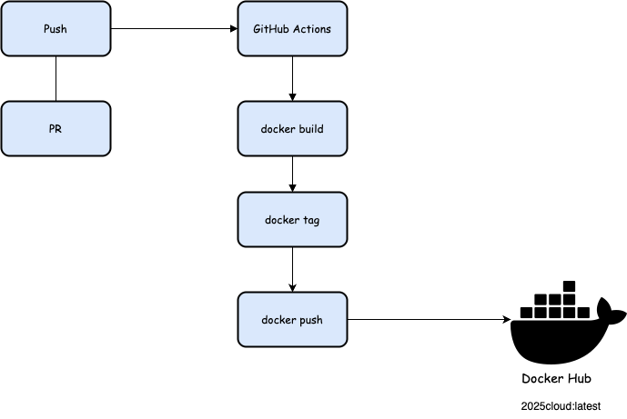

# app1

## 🐳 建立 Docker Image

請使用以下指令來建立 Docker Image：

```bash
docker build -t sandrali/app1 .
```

## 執行 Docker build完後的 Image

請使用以下指令來執行：
```bash
docker run -p 3000:3000 sandrali/app1
```

## 自動化流程說明（Docker Image) 建立與推送
每當有程式碼推送到 main 分支，或是對 main 分支開 PR，就會自動觸發以下流程：

1. **docker build — 建立 Image**
   - 使用目錄下的 Dockerfile 將應用程式打包成 Docker Image
   - 指令範例：
     ```bash
     docker build -t sandrali/app1 .
     ```
   - `-t sandrali/app1`：幫這個 image 命名為 `sandrali/app1`

2. **docker tag — 改名字 & 設定 tag**
   - 把剛剛建立的 image，重新命名為準備推送到 Docker Hub 的名稱
   - 例如：
     ```bash
     docker tag sandrali/app1 sandrali/2025cloud:latest
     ```
   - 其中 `latest` 是這個版本的 tag，代表「最新版」

3. **docker push — 推送到 Docker Hub**
   - 將 tag 過的 image 推送到 Docker Hub 的 `2025cloud` 倉庫中
   - 指令：
     ```bash
     docker push sandrali/2025cloud:latest
     ```

---

### 🖼️ 自動化流程圖：


